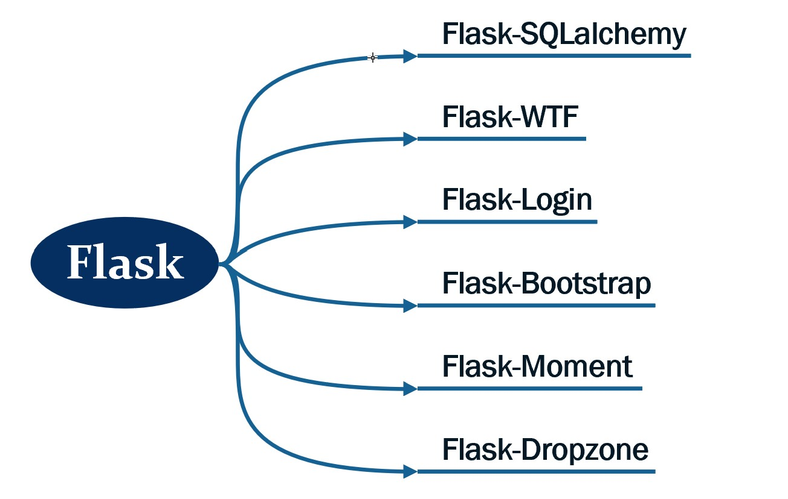
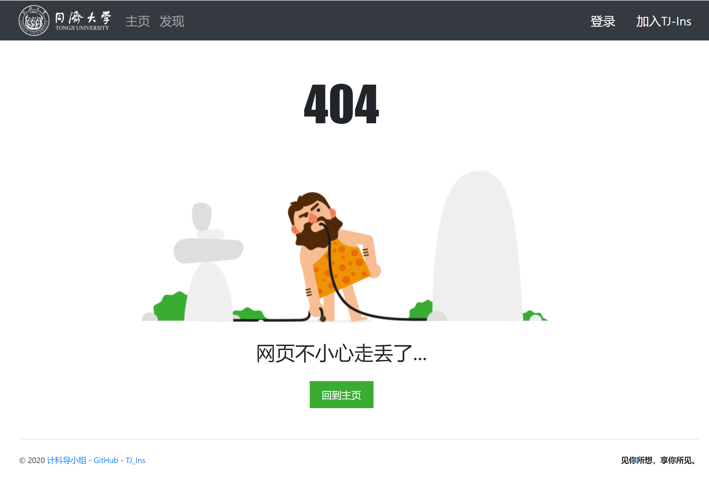

# 计科导大作业：TJ_INS

> 和朋友分享你的热爱，用照片记录你的生活&nbsp;&nbsp;&nbsp;&nbsp;&nbsp;&nbsp;&nbsp;&nbsp;TJ_Ins，你的生活，本就精彩.&nbsp;&nbsp;&nbsp;&nbsp;&nbsp;&nbsp;&nbsp;&nbsp;&nbsp;&nbsp;&nbsp;&nbsp;—— Group One
</br>

## 项目简介

* **类型：** 这是一个面向同济校内的**图片社交网站**，我们称它为 **同济-Ins**；

* **时间：** 项目前期准备时间较长，但从施工到大部分完成大约花费20天；

* **前后端：** 前端使用BootStrap，后端使用Flask实现；

  </br>

## 成员分工

|   姓名   | 负责 | 具体工作 |
| :------: | :--: | :------: |
| **张迪** |  组长  |  后端开发，前后端连接  |
|  胡昊育  |  后端  |  后端开发，项目文档  |
|  赵一凡  |  前端  |  所有前端文件的整理  |
|  裴书涵  |  前端  |  主页，图片展示页  |
|  魏鹏远  |  前端  |  主页，图片展示页  |
|  荆宇泉  |  前端  |  登录与注册页  |
|  赵颂霖  |  前端  |  登录与注册页  |
</br>

## 开发工具

- **后端：**

  

- **前端：**

  

</br>

## 运行方法

* 你可以直接点击 **[这里]**，浏览我们部署上线的网页😜，或者你可以按照 **下面的引导** 在本地浏览
* 首先，你需要将这个项目保存在电脑本地。为此你可以选择：
1.  点击上方绿色的 `Code`，选择 `Download ZIP` ，直接下载；
  2.  如果你的电脑上已经安装了 git 指令集，你也可以使用如下指令：
      ` git clone https://github.com/DinoMax00/SX-CS-Web.git` 
* 之后，你需要 `cd` 到项目所在目录下的 `../TongJi-Web` 目录
  * 如果你不熟悉 cd 指令，没关系，**[This]** will help you !
* 现在，你已经离在本地运行这个网站不远啦！你还需要依次执行以下指令：
```cmake
-> pipenv install
-> pipenv shell
-> flask initdb --drop
-> flask run
```

- 现在你就可以在本地运行我们的网页啦！

  > 哦？什么？提示没有 pipenv 指令？啊！看来你还是 python 新手啊！那还是建议你先好好回去夯实基础吧！
  >
  > ~~反正这个网站也没什么看头😁~~
  

</br>

## 网站功能

- **我们有一个功能丰富的好后端：**
  - [x] 用户的 **登录 + 登出 + 注册**，这些肯定有
  - [x] 在无聊的时候还可以 **浏览社区 + 发布图片**
  - [x] 看到别人的照片感触颇深，你还可以 **评论 + 收藏**
  - [x] 初始头像平平无奇，要想标新立异，还需 **头像修改**
  - [x] “昨天的我不是今天的我”，想要更新信息，还需 **资料修改**
  - [x] 每个用户都拥有自己的 **个人主页** (East or West, Home's Best)
  
- **我们有一个高端靓丽的好前端：**
  - [x] 整体 **同济风格**，大气不落俗套
  - [x] 风格一致的 **icon**，极致浏览体验
  - [x] 标配 **底部作者链接**，为网页标记身份
  - [x] 统一 **顶部导航栏**，让穿梭触手可及
  - [x] **评论框 + 上传框 + 编辑框**，框框简约
  - [x] **登录页 + 用户页 + 错误页**，页页精美

</br>

## 开发进度表

|       时间       |                        实现内容                        |
| :--------------: | :----------------------------------------------------: |
| 2020/11/22/15:00 |         创建了所有需要的文件夹，搭建了基本框架         |
| 2020/11/28/12:00 |                 完成了注册与登录的实现                 |
| 2020/11/28/19:00 |                   完成了图片上传功能                   |
| 2020/11/30/11:33 |       合并了一部分代码，修好了图片展示页面的bug        |
| 2020/12/01/21:22 |                  实现了主页图片的展示                  |
| 2020/12/01/22:24 |                   简单实现了个人主页                   |
| 2020/12/02/22:20 |           实现了一大堆功能，关注收藏评论等等           |
| 2020/12/03/10:50 | ~~数据结构课摸鱼~~ 基本完成了后端 ~~可以开始卷前端了~~ |
| 2020/12/05/0:47  |          完成了explore界面 (感觉还挺好看的😎)           |
| 2020/12/05/19:24 |           TJ_Ins 1.0 Released Successfully😉            |
| 2020/12/05/22:20 |                是时候开始卷项目文档了🐱‍👤                |
| 2020/12/06/21:00 |            正在部署上线服务器，但有点小问题            |
| 2020/12/08/23:24 |          http://8.131.99.180/😁           |

</br>

## 部分代码

- **额外定义flask命令行命令：**

  ```python
  def register_commands(app):
      # 数据库初始化
      @app.cli.command()
      @click.option('--drop', is_flag=True, help='初始化前删除旧库')  # 增加输入参数，通过is_flag设为bool类型
      def initdb(drop):
          if drop:
              click.confirm("这个操作将删除之前的数据库，确认继续吗？", abort=True)
              db.drop_all()
              click.echo("删除成功")
          db.create_all()
          click.echo("初始化数据库成功")
  ```

- **修改头像的代码：**

  ```python
  @user_bp.route('/settings/avatar')
  @login_required
  def change_avatar():
      upload_form = UploadAvatarForm()
      crop_form = CropAvatarForm()
      return render_template('user/settings/change_avatar.html', upload_form=upload_form, crop_form=crop_form)
  ```

- **收藏界面的代码：**

  ```html
  
  
  
  {{ user.name }}'s collection
  
      
      <div class="row">
          <div class="col-md-12">
                  
                      
                          {{ photo_card(collect.collected) }}
                      
                  
                      <div class="tip">
                          <h3>这里是空的~</h3>
                      </div>
                  
          </div>
      </div>
      
          <div class="page-footer">
              {{ render_pagination(pagination, align='center') }}
          </div>
      
  
  ```

</br>

## 网站截图：

  - **未登录的主页面：**

    

  - **404错误页面：**

    

  - **发现界面（社区界面）：**

    

</br>

## 小彩蛋

- 首先，欢迎各位打开电脑，点击 **[这里]**，或输入 "http://8.131.99.180" ，注册或登录自己的账户~😊

- 登录成功后，输入 "http://8.131.99.180/card/您的姓名" ，会有您专属的 **可爱猫图** 和 **美好祝福** ~💕

- 样例截图：

  


[This]: https://jingyan.baidu.com/article/6079ad0ec0145b28ff86db88.html
[这里]: http://8.131.99.180